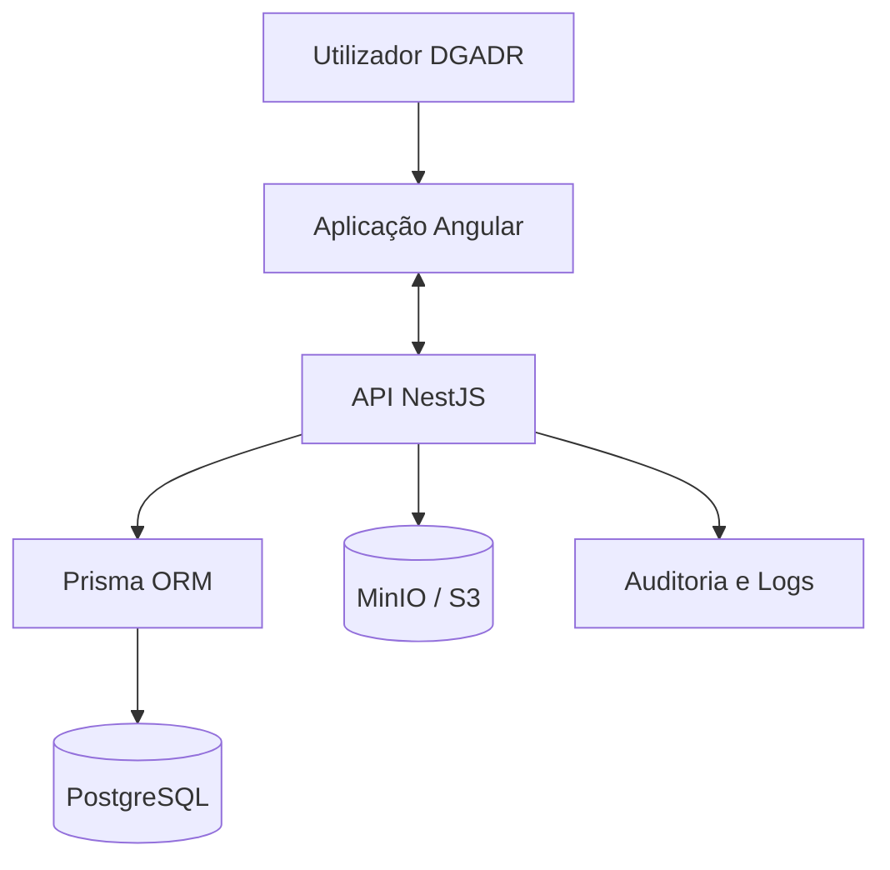
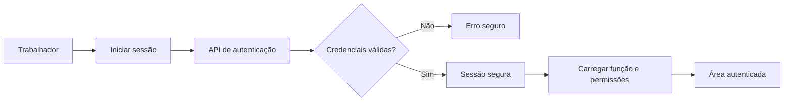
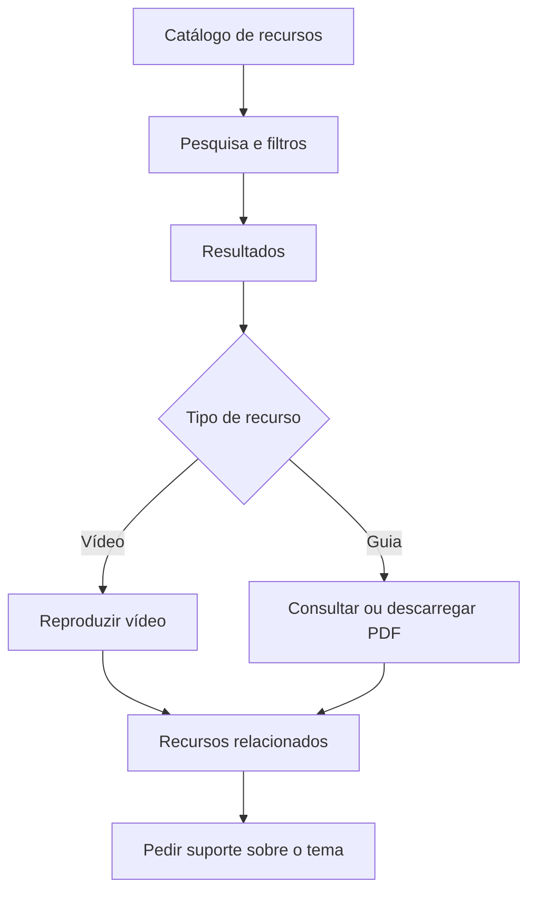
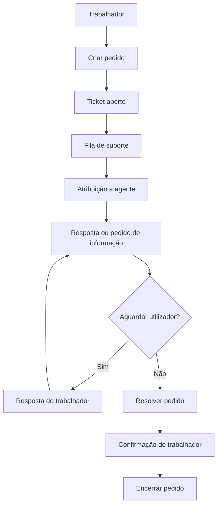

# Filedoc Recursos Formativos — Especificações do Projeto

🚀 **Portal centralizado de formação e suporte para utilizadores do Filedoc na DGADR**

---

## 📌 Problema

Os recursos formativos e os pedidos de ajuda relacionados com o Filedoc encontram-se frequentemente dispersos por pastas partilhadas, mensagens de correio eletrónico, documentos PDF avulsos, vídeos gravados em momentos diferentes, instruções informais, respostas dadas individualmente a colegas e diferentes canais de suporte.

Esta dispersão traz consequências diretas para os trabalhadores da DGADR:

- dificuldade em encontrar o conteúdo certo no momento certo;
- repetição das mesmas dúvidas por diferentes pessoas;
- perda de tempo na procura de informação já existente;
- utilização de instruções desatualizadas;
- inconsistência na forma como os procedimentos são executados;
- falta de acompanhamento dos pedidos de suporte já colocados;
- dependência excessiva de apoio individual de colegas mais experientes.

**Solução:**

> O Filedoc Recursos Formativos disponibiliza um único portal interno, pesquisável e organizado, para aprendizagem, consulta de documentação e suporte relacionado com a plataforma Filedoc.

---

## 🧑‍💼 Utilizadores

| Persona                    | Necessidades                                                       |
| -------------------------- | ------------------------------------------------------------------ |
| Trabalhador da DGADR       | Encontrar rapidamente vídeos, guias, dicas e respostas             |
| Novo utilizador do Filedoc | Aprender os fluxos básicos através de conteúdos de iniciação       |
| Utilizador experiente      | Consultar procedimentos específicos e conteúdos avançados          |
| Editor de conteúdos        | Criar, atualizar, publicar e arquivar recursos formativos          |
| Agente de suporte          | Receber, responder, classificar e acompanhar pedidos               |
| Administrador              | Gerir utilizadores, funções, taxonomias, configurações e auditoria |

**Funções aplicacionais:**

- `EMPLOYEE`;
- `CONTENT_EDITOR`;
- `SUPPORT_AGENT`;
- `ADMIN`.

A autorização associada a cada função deve ser aplicada tanto no frontend, para orientar a experiência do utilizador, como no backend, onde reside o verdadeiro controlo de acesso. A ocultação de elementos na interface nunca substitui a validação de permissões no servidor.

---

## ✨ Funcionalidades principais

### A) Recursos formativos

- vídeos;
- guias passo a passo em PDF;
- miniaturas;
- descrições;
- duração dos vídeos;
- número de páginas ou passos dos guias;
- conteúdos relacionados;
- indicação da data de atualização.

### B) Organização dos conteúdos

Os recursos são organizados por fluxo, tipo de documento, dificuldade, etiquetas, tipo de recurso e estado editorial.

**Fluxos iniciais:**

- Criação e registo;
- Correspondência;
- Tramitação;
- Assinatura;
- Pesquisa;
- Gestão documental;
- Arquivo;
- Correções.

**Tipos de documento iniciais:**

- Informação;
- Ofício;
- Despacho;
- Processo;
- Correspondência;
- Anexo;
- Diversos.

**Níveis de dificuldade:**

- Iniciação;
- Intermédia;
- Avançada.

### C) Pesquisa e filtros

- pesquisa por título;
- pesquisa por descrição;
- pesquisa por etiquetas;
- filtro por tipo de recurso;
- filtro por fluxo;
- filtro por tipo de documento;
- filtro por dificuldade;
- ordenação;
- paginação;
- contador de resultados;
- limpeza de filtros;
- estado sem resultados.

### D) Dicas e perguntas frequentes

- dicas rápidas;
- perguntas frequentes organizadas;
- acordeões acessíveis;
- conteúdos publicados e geridos por editores;
- ordem de apresentação configurável.

### E) Pedidos de suporte

- criação de ticket;
- referência única;
- categoria;
- prioridade;
- descrição;
- recurso relacionado;
- anexos;
- mensagens;
- histórico;
- responsável;
- estados;
- notas internas;
- confirmação da resolução.

**Estados dos tickets:**

- Aberto;
- Em tratamento;
- A aguardar resposta do utilizador;
- Resolvido;
- Encerrado.

**Prioridades:**

- Baixa;
- Normal;
- Alta;
- Bloqueante.

### F) Área editorial

- criação de recursos;
- edição;
- rascunhos;
- publicação;
- despublicação;
- arquivo;
- carregamento de vídeos;
- carregamento de PDFs;
- gestão de miniaturas;
- gestão de dicas;
- gestão de perguntas frequentes;
- gestão de fluxos, tipos de documento e etiquetas.

### G) Administração

- gestão de utilizadores;
- atribuição de funções;
- ativação e desativação de contas;
- consulta de auditoria;
- gestão de taxonomias;
- configurações da aplicação.

### H) Autenticação

No MVP:

- e-mail e palavra-passe;
- sessões seguras;
- ausência de registo público;
- contas criadas ou importadas administrativamente;
- preparação para futura integração OIDC/SSO institucional.

Não é definido nem inventado, nesta fase, o fornecedor de identidade da DGADR, por não existir ainda confirmação institucional sobre este ponto.

---

## 🗄️ Modelo de dados

O modelo apresentado de seguida é uma proposta inicial e poderá evoluir durante a implementação, através de migrações Prisma versionadas.

### `User`

Responsável pelos dados dos utilizadores: identificador; nome; e-mail; hash da palavra-passe; função; estado; último acesso; datas de criação e atualização.

### `Session`

Responsável pelas sessões autenticadas: utilizador; token ou hash seguro; expiração; revogação; datas.

### `Resource`

Responsável pelos vídeos e guias: título; slug; resumo; descrição; tipo; dificuldade; fluxo; tipo de documento; estado editorial; duração; número de passos; número de páginas; referências dos ficheiros; publicação; autores; datas.

### `Workflow`

Responsável pelos fluxos documentais.

### `DocumentType`

Responsável pelos tipos de documento.

### `Tag`

Responsável pelas etiquetas.

### `ResourceTag`

Relação muitos-para-muitos entre recursos e etiquetas.

### `Tip`

Responsável pelas dicas rápidas.

### `Faq`

Responsável pelas perguntas frequentes.

### `SupportTicket`

Responsável pelos pedidos de suporte: referência; assunto; descrição; categoria; prioridade; estado; solicitante; responsável; recurso relacionado; resolução; encerramento; datas.

### `TicketMessage`

Responsável pelas mensagens públicas e notas internas.

### `TicketAttachment`

Responsável pelos metadados dos anexos.

### `AuditLog`

Responsável pelo registo de operações administrativas e ações sensíveis.

**Notas gerais sobre o modelo:**

- a base de dados guarda apenas metadados dos ficheiros;
- vídeos, PDFs, miniaturas e anexos são guardados em armazenamento de objetos, fora do PostgreSQL;
- devem existir índices para pesquisa, filtros, slugs, referências e estados;
- as relações e restrições entre entidades devem garantir integridade referencial.

---

## 🧱 Stack tecnológica

| Categoria                  | Tecnologia                                                       |
| -------------------------- | ---------------------------------------------------------------- |
| Frontend                   | Angular                                                          |
| Linguagem                  | TypeScript em modo estrito                                       |
| Estilos                    | SCSS                                                             |
| Componentes                | Angular standalone components                                    |
| Formulários                | Angular Reactive Forms                                           |
| Estado local               | Angular Signals                                                  |
| Navegação                  | Angular Router                                                   |
| UI acessível               | Angular Material e Angular CDK, quando justificado               |
| Backend                    | NestJS                                                           |
| API                        | REST com OpenAPI/Swagger                                         |
| ORM                        | Prisma                                                           |
| Base de dados              | PostgreSQL                                                       |
| Armazenamento de ficheiros | MinIO em desenvolvimento e serviço compatível com S3 em produção |
| Autenticação               | Sessões seguras com cookies `HttpOnly`                           |
| Testes frontend            | Testes unitários Angular                                         |
| Testes backend             | Jest ou ferramenta integrada no NestJS                           |
| Testes E2E                 | Playwright                                                       |
| Infraestrutura local       | Docker e Docker Compose                                          |
| CI/CD                      | GitHub Actions ou pipeline equivalente                           |
| Observabilidade            | Logs estruturados e health checks                                |

**Nota sobre a escolha do PostgreSQL:** trata-se de dados fortemente relacionais — recursos, utilizadores, tickets, taxonomias e auditoria — em que a integridade referencial e o suporte a transações são fundamentais. O PostgreSQL, associado ao Prisma, oferece uma combinação sólida e madura para estes requisitos.

---

## 💰 Monetização

> Não aplicável. O portal é um serviço interno da DGADR e deve estar disponível sem custos para todos os trabalhadores autorizados.

| Elemento                 | Decisão        |
| ------------------------ | -------------- |
| Pagamentos               | Não existem    |
| Subscrições              | Não existem    |
| Planos comerciais        | Não existem    |
| Limites por utilizador   | Não aplicáveis |
| Faturação                | Não aplicável  |
| Integrações de pagamento | Não permitidas |

---

## 🎨 UI/UX

A direção visual do portal é institucional, moderna, orientada para documentação técnica, inspirada em portais de documentação e ferramentas de desenvolvimento, simples de utilizar por trabalhadores com diferentes níveis de experiência digital, e compatível com modo claro e escuro.

### Identidade visual

Utiliza o logótipo da DGADR e o logótipo do Filedoc, com cores extraídas visualmente destes elementos gráficos: azul-petróleo, verde, azul-claro, amarelo, laranja, coral, ameixa e cinzentos escuros.

Não é permitido: distorcer os logótipos; recolorir as marcas; inventar cores institucionais oficiais sem confirmação; comprometer o contraste da interface.

### Estrutura principal

- cabeçalho;
- navegação principal;
- pesquisa global;
- página inicial;
- catálogo de recursos;
- detalhe de vídeo;
- detalhe de guia;
- dicas;
- perguntas frequentes;
- área de suporte;
- área editorial;
- área administrativa;
- rodapé.

### Responsividade

- menu móvel;
- filtros adaptáveis;
- cartões responsivos;
- tabelas utilizáveis em telemóvel;
- formulários acessíveis;
- suporte a larguras entre 320 px e ecrãs largos;
- ausência de deslocamento horizontal indevido.

### Acessibilidade

Conformidade com WCAG 2.2 AA, incluindo: navegação por teclado; foco visível; contraste adequado; labels associados; erros associados aos campos correspondentes; diálogos acessíveis; estados não dependentes apenas da cor; suporte para redução de movimento; conteúdo em português de Portugal; compatibilidade com leitores de ecrã.

---

### Screenshots

Tem como referência visual os screenshots disponíveis em @context/screenshots. Não tem de ser exato. Usa apenas como referência visual.

## 🔌 Arquitetura da aplicação



- o Angular disponibiliza a interface aos trabalhadores;
- o NestJS centraliza as regras de negócio, a autenticação e a autorização;
- o Prisma gere o acesso aos dados;
- o PostgreSQL guarda os dados relacionais da aplicação;
- o MinIO, em desenvolvimento, ou um serviço compatível com S3, em produção, guarda vídeos, PDFs, miniaturas e anexos;
- a API valida sempre o acesso aos ficheiros privados antes de os disponibilizar.

---

## 🔐 Fluxo de autenticação



- não existe registo público;
- as palavras-passe são armazenadas com um algoritmo resistente, como o Argon2id;
- as sessões utilizam cookies seguros com atributo `HttpOnly`;
- utilizadores desativados não podem iniciar sessão;
- a arquitetura deve permitir uma futura integração com OIDC, sem que essa integração esteja definida nesta fase.

---

## 🎓 Fluxo de consulta de recursos



---

## 🎫 Fluxo de suporte



Este fluxo distingue claramente dois tipos de comunicação: mensagens visíveis ao trabalhador que criou o pedido, e notas internas, visíveis apenas à equipa de suporte e aos administradores.

---

## 🔐 Segurança e privacidade

- autorização por função e por recurso;
- validação no backend;
- proteção contra XSS, CSRF e injeção;
- cookies seguros;
- rate limiting;
- controlo de uploads;
- URLs temporários para ficheiros;
- segredos em variáveis de ambiente;
- auditoria;
- logs sem palavras-passe, tokens ou conteúdo sensível;
- minimização dos dados;
- retenção configurável;
- conformidade com o RGPD;
- ausência de serviços externos de rastreamento por defeito.

> Um trabalhador apenas pode consultar os próprios tickets, mensagens e anexos.

---

## 🗂️ Organização técnica

```text
filedoc-dgadr-recursos/
├── apps/
│   ├── web/
│   └── api/
├── packages/
│   └── shared-types/
├── prisma/
├── infrastructure/
├── docs/
├── docker-compose.yml
├── .env.example
├── package.json
└── README.md
```

A localização do Prisma pode ser adaptada em função da estrutura real dos projetos Angular e NestJS, mantendo sempre uma separação clara entre frontend, backend, dados, infraestrutura e documentação.

---

## 🗂️ Fluxo de desenvolvimento

- uma branch por funcionalidade;
- pull requests pequenas;
- revisão antes de integração;
- migrações Prisma versionadas;
- dados de seed apenas para desenvolvimento;
- lint;
- verificação TypeScript;
- testes unitários;
- testes de integração;
- testes E2E;
- testes de acessibilidade;
- build antes de merge.

**Exemplos de branches:**

```text
feature/authentication
feature/resource-catalog
feature/support-tickets
feature/content-management
feature/admin-users
```

---

## 🧭 Roadmap

### MVP

- autenticação local;
- funções e permissões;
- página inicial;
- catálogo de recursos;
- pesquisa e filtros;
- reprodução de vídeos;
- consulta de PDFs;
- dicas;
- perguntas frequentes;
- criação de tickets;
- acompanhamento de tickets;
- respostas do suporte;
- gestão editorial;
- gestão de utilizadores;
- PostgreSQL;
- Prisma;
- armazenamento MinIO;
- testes essenciais;
- Docker.

### Segunda fase

- integração OIDC/SSO institucional;
- notificações por correio eletrónico;
- legendas e transcrições;
- favoritos;
- avaliação da utilidade dos recursos;
- sugestões de recursos relacionadas com tickets;
- indicadores agregados;
- melhorias de pesquisa.

### Evolução futura

- integração controlada com sistemas internos;
- importação de utilizadores;
- pesquisa avançada;
- aplicações móveis ou PWA, caso exista necessidade;
- integração com uma plataforma institucional de observabilidade;
- gestão de retenção e arquivo mais avançada.

Não são incluídas funcionalidades de pagamento em nenhuma fase.

---

## 📌 Estado atual

- planeamento funcional concluído;
- stack principal definida;
- aplicação Angular iniciada;
- SCSS selecionado;
- SSR e SSG desativados, por se tratar de uma aplicação interna autenticada;
- PostgreSQL e Prisma definidos para persistência;
- NestJS definido para a API;
- projeto pronto para a configuração da arquitetura, da base de dados e da autenticação.

---

## ✅ Princípios do projeto

- funcionalidade antes de decoração;
- segurança no backend;
- acessibilidade desde o início;
- conteúdos fáceis de encontrar;
- interface simples e consistente;
- dados persistentes;
- ausência de pagamentos;
- dependências apenas quando justificadas;
- documentação atualizada;
- evolução incremental;
- nenhuma funcionalidade crítica simulada no frontend.

---

🏗️ **Filedoc Recursos Formativos — Aprender, consultar e obter apoio num único portal.**
